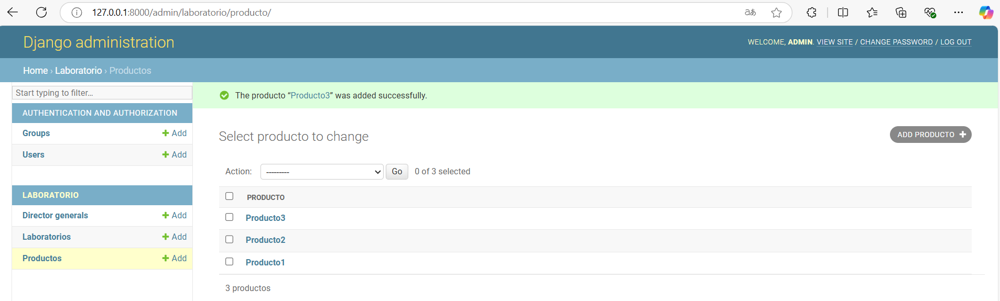

# EjercicioFinalLaboratorio
Educativo y de Aprendizaje Personal

---
## Tabla de Contenidos
- [Requisitos](#requisitos)
- [Configuración del Entorno](#configuración-del-entorno)
- [Activación del Entorno](#Activación-del-Entorno)
- [Configuración Inicial](#configuración-inicial)
- [Pasos del Proyecto](#pasos-del-proyecto)
- [Configuración Base de datos](#configuración-Base-de-datos)
  - [Creación del Modelo ](#creación-del-modelo)
  - [Creamos el superusuario](#creamos-el-superusuario)
  - [Parte 2](#parte-2)
  - [Parte 3](#parte-3)
  - [Parte 4](#parte-4)
---

## Requisitos
- Django 4.0 o superior
---


## Configuración del Entorno

1. Crear el entorno virtual:
   ```bash
   python -m venv venv


## Activación del Entorno

2. Activar el entorno virtual:
    ### Windows
    ```bash
    venv\Scripts\activate

## Configuración Inicial
## Instalar Django y Guardar dependencias

3. Intalación Django y pyscopg2
    ```bash
    pip install django==4.1.1 psycopg2

4. Instalamos la actualizacion de pip
    ```bash
    python.exe -m pip install --upgrade pip

## Guardar las dependencias
5. Instalación dependencias
    ```bash
   pip freeze > requirements.txt

## Pasos del Proyecto

6. Crear el Proyecto
    ```bash
    cd config
    django-admin startproject practica_final_orm_django

7. Ingresar al directorio del Proyecto
    ```bash
    cd practica_final_orm_django

8. Creamos la Aplicación laboratorio 
    ```bash
   python manage.py startapp laboratorio

9. Conectar el proyecto con la aplicación: Agregar 'laboratorio' en la lista INSTALLED_APPS dentro del archivo config/practica_final_orm_django/settings.py

    ```bash
    INSTALLED_APPS = [
    'django.contrib.admin',
    'django.contrib.auth',
    'django.contrib.contenttypes',
    'django.contrib.sessions',
    'django.contrib.messages',
    'django.contrib.staticfiles',
    'laboratorio',
    ]
# Configuración Base de datos
10. Instalar python-decouple: Es una biblioteca que ayuda manejar las variables de entorno 
    ```bash
    pip install python-decouple

11. Creamos el archivo .env a la altura del proyecto al lado manage.py 
    ```bash
    DATABASE_NAME=db_final_orm
    DATABASE_USER=postgres
    DATABASE_PASSWORD=yourpassword
    DATABASE_HOST=localhost
    DATABASE_PORT=5432

12. Configuracion de la base de datos ingresando los parametros de conexión 
    ```bash
    from decouple import config

    DATABASES = {
        'default': {
            'ENGINE': 'django.db.backends.postgresql',
            'NAME': config('DATABASE_NAME'),
            'USER': config('DATABASE_USER'),
            'PASSWORD': config('DATABASE_PASSWORD'),
            'HOST': config('DATABASE_HOST'),
            'PORT': config('DATABASE_PORT'),
        }
    }
13. Guardamos dependencias
    ```bash
    cd ..
    cd ..
    pip freeze > requirements.txt

# Creación del Modelo 

14. en config/practica_final_orm_laboratorio/laboratoio/models.py
    ```bash
    from django.db import models
    from django.core.exceptions import ValidationError
    from datetime import date

    class Laboratorio(models.Model):
        nombre = models.CharField(max_length=255)

        def __str__(self):
            return self.nombre

    class DirectorGeneral(models.Model):
        nombre = models.CharField(max_length=255)
        laboratorio = models.OneToOneField(Laboratorio, on_delete=models.CASCADE)

        def __str__(self):
            return self.nombre

    class Producto(models.Model):
        nombre = models.CharField(max_length=255)
        laboratorio = models.ForeignKey('Laboratorio', on_delete=models.CASCADE)
        f_fabricacion = models.DateField(null=True, blank=True)  
        p_costo = models.DecimalField(max_digits=12, decimal_places=2)
        p_venta = models.DecimalField(max_digits=12, decimal_places=2)

        def clean(self):
            if self.f_fabricacion:  # Validar solo si f_fabricacion no es None
                if self.f_fabricacion < date(2015, 1, 1):
                    raise ValidationError("La fecha de fabricación no puede ser anterior a 2015.")

        def __str__(self):
            return self.nombre


15. Aplicar Migraciones 
    ```bash
    python manage.py makemigrations laboratorio
    python manage.py migrate

# Creamos el superusuario
16. Creamos el administrador de la base de datos
    ```bash	
    python manage.py createsuperuser

17. Se Crea un contraseña solo para fines pedagogicos y para ir testeando el modelo
    ```bash	
    admin
    admin@gmail.com
    admin1234
    y
18. config/practica_final_orm_django/laboratorio/admin.py
    ```bash
    from django.contrib import admin
    from .models import Laboratorio, DirectorGeneral, Producto

    # Register your models here.
    admin.site.register(Laboratorio)
    admin.site.register(DirectorGeneral)
    admin.site.register(Producto)

19. Nos Vamos a la pagina 127.0.0.1:8000/admin
    ```bash
    python manage.py runserver

## Parte 2 
20. Adecue el sitio administrativo de Django agregando los modelos Laboratorio, director general,
y Productos, para que se muestre de la siguiente manera:
<p align="center">
  
</p>

21. Adecue la interfaz administrativa con la finalidad de que se observe de la siguiente manera, y
agregue los siguientes Laboratorios:

<p align="center">
  
</p>

22. Adecue la interfaz administrativa con la finalidad de que se observe de la siguiente manera, y
agregue por medio de la interfaz administrativa, los siguientes directores generales:

<p align="center">
  
</p>

23. Adecue la interfaz administrativa con la finalidad de que se observe de la siguiente manera, y
agregue por medio de la interfaz administrativa, los siguientes Productos:

<p align="center">
  
</p>

24. Por medio de la consola interpretador de python (shell), realice las siguientes consultas:
    ```bash
    python manage.py shell

25. Importar los modelos
    ```bash
    from laboratorio.models import Laboratorio, DirectorGeneral, Producto

26. Realizar las consultas Consulta 1: Obtener todos los objetos de Laboratorio, DirectorGeneral, y Producto (Eliminar los espacios a los lados)
    ```bash
    # Todos los objetos de Laboratorio
    laboratorios = Laboratorio.objects.all()
    print("Laboratorios:", laboratorios)

    # Todos los objetos de DirectorGeneral
    directores = DirectorGeneral.objects.all()
    print("Directores Generales:", directores)

    # Todos los objetos de Producto
    productos = Producto.objects.all()
    print("Productos:", productos)


27. Consulta 2: Obtener el laboratorio del Producto cuyo nombre es ‘Producto 1’
    ```bash
    producto = Producto.objects.get(nombre='Producto1') 
    laboratorio = producto.laboratorio  
    print("Laboratorio de Producto 1:", laboratorio)

28. Consulta 3: Ordenar todos los productos por nombre y mostrar nombre y laboratorio
    ```bash
    productos_ordenados = Producto.objects.order_by('nombre') 
    for producto in productos_ordenados:
        print(f"Nombre: {producto.nombre}, Laboratorio: {producto.laboratorio}")

29. Consulta 4: Mostrar los laboratorios de todos los productos
    ```bash
    productos = Producto.objects.all()  
    for producto in productos:
        print(f"Producto: {producto.nombre}, Laboratorio: {producto.laboratorio}")

## Parte 3

30. Realice las siguientes modificaciones al modelo, agregando los siguientes campos:
    La nueva migración se llamará actualizado_campos.
    ● Laboratorio:
    ○ ciudad: cadena de caracteres.
    ○ pais: cadena de caracteres.
    ● DirectorGeneral:
    ○ especialidad: cadena de caracteres.
    Muestre todas las migraciones realizadas.

    ```bash
    # En laboratorio/models.py

    from django.db import models
    from django.core.exceptions import ValidationError
    from datetime import date

    class Laboratorio(models.Model):
        nombre = models.CharField(max_length=255, unique=True)
        ciudad = models.CharField(max_length=255, null=True, blank=True)
        pais = models.CharField(max_length=255, null=True, blank=True)

    
        def __str__(self):
            return self.nombre


    class DirectorGeneral(models.Model):
        nombre = models.CharField(max_length=255)
        laboratorio = models.OneToOneField(Laboratorio, on_delete=models.CASCADE)
        especialidad = models.CharField(max_length=255, null=True, blank=True) 

        def __str__(self):
            return self.nombre


    class Producto(models.Model):
        nombre = models.CharField(max_length=255)
        laboratorio = models.ForeignKey(Laboratorio, on_delete=models.CASCADE)
        f_fabricacion = models.DateField(null=True, blank=True)
        p_costo = models.DecimalField(max_digits=12, decimal_places=2)
        p_venta = models.DecimalField(max_digits=12, decimal_places=2)

        def clean(self):
            if self.f_fabricacion:
                if self.f_fabricacion < date(2015, 1, 1):
                    raise ValidationError("La fecha de fabricación no puede ser anterior a 2015.")

        def __str__(self):
            return self.nombre
31. Crea la migracion
    ```bash
    python manage.py makemigrations 

32. Aplicamos la migraciòn
    ```bash
    python manage.py migrate

## Parte 4

33. Creamos las vistas laboratorio/views.py
    ```bash
    from django.views.generic import ListView
    from django.views.generic import DetailView
    from django.views.generic import CreateView, UpdateView, DeleteView, FormView
    from django.urls import reverse_lazy
    from .models import Laboratorio
    from django.db.models import F
    import re
    
    class ListarLaboratorio(ListView):
    model = Laboratorio
    template_name = 'laboratorio/lista_laboratorio.html'
    context_object_name = 'laboratorios'

    def ordenar_por_nombre(self, queryset):
        # Función para extraer números y manejar espacios correctamente
        def clave_orden(nombre):
            return [int(texto) if texto.isdigit() else texto.lower().strip() for texto in re.split(r'(\d+)', nombre)]

        # Ordenar usando la clave personalizada
        return sorted(queryset, key=lambda obj: clave_orden(obj.nombre))

    def get_queryset(self):
        queryset = super().get_queryset()
        return self.ordenar_por_nombre(queryset)

    def get_context_data(self, **kwargs):
        context = super().get_context_data(**kwargs)
        # Obtener el contador de visitas desde las cookies del usuario
        visitas = int(self.request.COOKIES.get('visitas', 0)) + 1
        context['contador_visitas'] = visitas  # Agregar al contexto
        return context

    def render_to_response(self, context, **response_kwargs):
        # Sobrescribir para configurar la cookie
        response = super().render_to_response(context, **response_kwargs)
        response.set_cookie('visitas', context['contador_visitas'], max_age=60 * 60 * 24 * 30)  # 30 días
        return response
        

    class DetalleLaboratorio( DetailView):
        model = Laboratorio
        template_name ='laboratorio/laboratorio.html'
        context_object_name = 'laboratorio'
        
    class CrearLaboratorio(CreateView):
        model = Laboratorio
        fields = ['nombre', 'ciudad', 'pais'] 
        success_url = reverse_lazy('laboratorios')
        template_name = 'laboratorio/formulario_laboratorio.html'  # Nueva plantilla compartida

        def get_context_data(self, **kwargs):
            context = super().get_context_data(**kwargs)
            context['titulo'] = "Ingresar Laboratorio"  # Título para la página
            context['boton_texto'] = "Crear"  # Texto del botón
            return context
        
    class EditarLaboratorio(UpdateView):
        model = Laboratorio
        fields = ['nombre', 'ciudad', 'pais'] 
        success_url = reverse_lazy('laboratorios')
        template_name = 'laboratorio/formulario_laboratorio.html'  # Nueva plantilla compartida

        def get_context_data(self, **kwargs):
            context = super().get_context_data(**kwargs)
            context['titulo'] = "Actualizar Laboratorio"  # Título para la página
            context['boton_texto'] = "Actualizar"  # Texto del botón
            return context
        
    class EliminarLaboratorio(DeleteView):
        model = Laboratorio
        template_name ='laboratorio/eliminar_laboratorio.html'
        context_object_name = 'laboratorio'
        success_url = reverse_lazy('laboratorios')

34. Se crean los templates/laboratorio/ lista_laboratorios.html
    ```bash
    
    <!DOCTYPE html>
    <html lang="en">

    <head>
        <meta charset="UTF-8">
        <meta name="viewport" content="width=device-width, initial-scale=1.0">
        <link rel="stylesheet" href="">
        <title>Lista de Laboratorios</title>
    </head>

    <body>
        <div class="barra-superior">
            <a id="enlace-agregar" href="">Agregar laboratorio</a>
        </div>

        <h2>Información de Laboratorios</h2>
        <div class="cuerpo-tarjeta">
            <table>
                <thead>
                    <tr>
                        <th>Nombre</th>
                        <th>Ciudad</th>
                        <th>País</th>
                        <th>Edit</th>
                        <th>Delete</th>
                    </tr>
                </thead>
                <tbody>
                    
                    <tr>
                        <td>{{ laboratorio.nombre }}</td>
                        <td>{{ laboratorio.ciudad }}</td>
                        <td>{{ laboratorio.pais }}</td>
                        <td><a href="">Actualizar</a></td>
                        <td><a href="">Eliminar</a></td>
                    </tr>
                    
                    <tr>
                        <td colspan="5">No hay elementos en esta lista</td>
                    </tr>
                    
                </tbody>
            </table>
        </div>

        <footer>
            <p>¿Información de los Laboratorios?</p>
            <a href="">Ir a la página de inicio</a>
            <p>Usted ha visitado esta página {{ contador_visitas }} veces.</p>
        </footer>
    </body>

    </html>

35. Se crean los templates/laboratorio/laboratorio.html
    ```bash
    <h1>laboratorio: {{laboratorio}}</h1>

36. Se crea los templates/laboratorio/formulario_laboratorio.html
    ```bash
    
    <!DOCTYPE html>
    <html lang="en">

    <head>
        <meta charset="UTF-8">
        <meta name="viewport" content="width=device-width, initial-scale=1.0">
        <link rel="stylesheet" href="">
        <title>Lista de Laboratorios</title>
    </head>

    <body>
        
        <div class="barra-superior">
            <a href="">&#x1F860; Volver</a>
        </div>
        <div class="cuerpo-tarjeta">
            <h1>{{ titulo }}</h1> <!-- Título dinámico -->
            <form method="POST" action="">
                
                {{ form.as_p }}
                <input class="boton" type="submit" value="{{ boton_texto }}"> <!-- Texto del botón -->
            </form>
        </div>
        
    </body>

    </html>

37. templates/laboratorio/eliminar_laboratorio.html
    ```bash
    
    <div class="cuerpo-tarjeta">
        <form method="POST">
            
            <p>Estas seguro que deseas eliminar el laboratorio: "{{laboratorio}}"</p>
            <input class='boton' type="submit" value="Confirm">
        </form>
    </div>
    <div class="barra-superior">
        <a href="">&#x1F860; Retornar</a>
    </div>
    

38. Configuración de  urls  laborario/urls.py
    ```bash
    from django.urls import path
    from .views import ListarLaboratorio, CrearLaboratorio, EditarLaboratorio, EliminarLaboratorio

    urlpatterns = [
        path('', ListarLaboratorio.as_view(), name='laboratorios'),
        path('crear/', CrearLaboratorio.as_view(), name='crear-laboratorio'),
        path('editar/<int:pk>/', EditarLaboratorio.as_view(), name='editar-laboratorio'),
        path('eliminar/<int:pk>/', EliminarLaboratorio.as_view(), name='eliminar-laboratorio'),
    ]
39. Configuración de urls de config/practica_final_orm_django/practica_final_orm_orm
    ```bash
    from django.contrib import admin
    from django.urls import path, include

    urlpatterns = [
        path('admin/', admin.site.urls),
        path('',include('laboratorio.urls')),
    ]

40. Accedemos a las ruta principal (http://127.0.0.1:8000/)
    ```bash
    python manage.py runserver