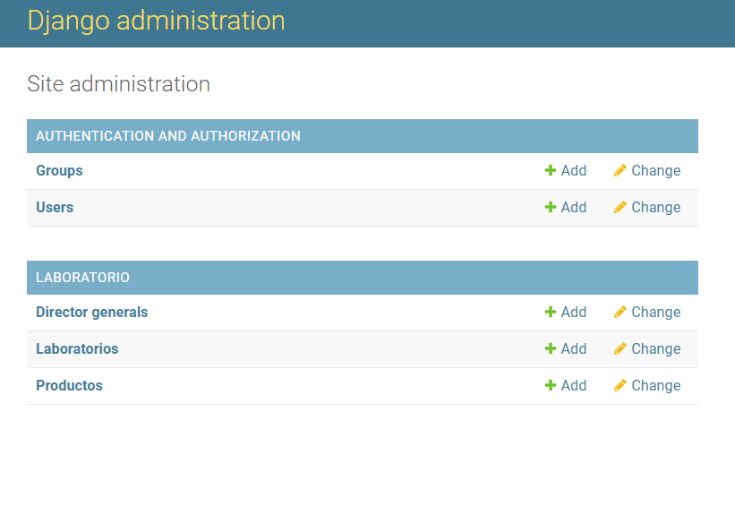
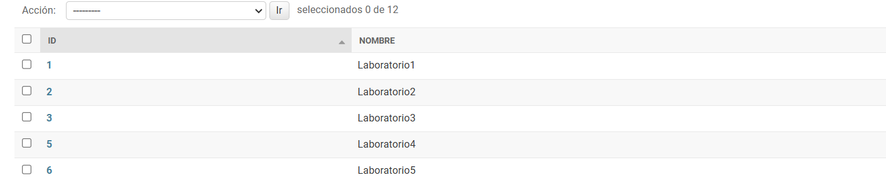
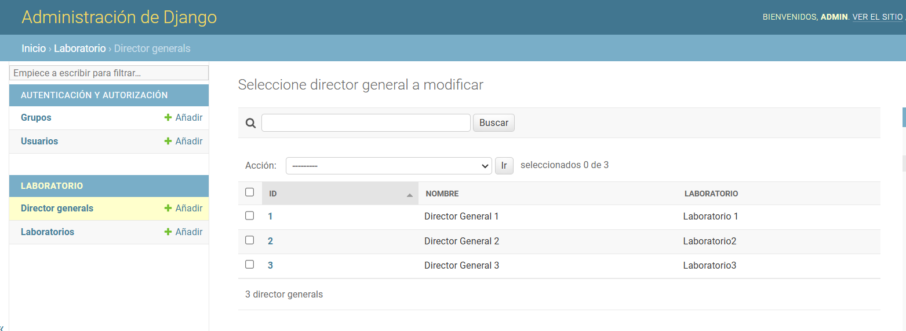

# EjercicioFinalLaboratorio
Educativo y de Aprendizaje Personal

---
## Tabla de Contenidos
- [Requisitos](#requisitos)
- [Configuración del Entorno](#configuración-del-entorno)
- [Activación del Entorno](#Activación-del-Entorno)
- [Configuración Inicial](#configuración-inicial)
- [Pasos del Proyecto](#pasos-del-proyecto)
- [Configuración Base de datos](#configuración-Base-de-datos)
  - [Creación del Modelo ](#creación-del-modelo)
  - [Creamos el superusuario](#creamos-el-superusuario)
  - [Parte2](#parte2)
---

## Requisitos
- Django 4.0 o superior
---


## Configuración del Entorno

1. Crear el entorno virtual:
   ```bash
   python -m venv venv


## Activación del Entorno

2. Activar el entorno virtual:
    ### Windows
    ```bash
    venv\Scripts\activate

## Configuración Inicial
## Instalar Django y Guardar dependencias

3. Intalación Django y pyscopg2
    ```bash
    pip install django==4.1.1 psycopg2

4. Instalamos la actualizacion de pip
    ```bash
    python.exe -m pip install --upgrade pip

## Guardar las dependencias
5. Instalación dependencias
    ```bash
   pip freeze > requirements.txt

## Pasos del Proyecto

6. Crear el Proyecto
    ```bash
    django-admin startproject practica_final_orm_django

7. Ingresar al directorio del Proyecto
    ```bash
    cd practica_final_orm_django

8. Creamos la Aplicación laboratorio 
    ```bash
   python manage.py startapp laboratorio

9. Conectar el proyecto con la aplicación: Agregar 'laboratorio' en la lista INSTALLED_APPS dentro del archivo config/practica_final_orm_django/settings.py

    ```bash
    INSTALLED_APPS = [
    'django.contrib.admin',
    'django.contrib.auth',
    'django.contrib.contenttypes',
    'django.contrib.sessions',
    'django.contrib.messages',
    'django.contrib.staticfiles',
    'laboratorio',
    ]
# Configuración Base de datos
10. Instalar python-decouple: Es una biblioteca que ayuda manejar las variables de entorno 
    ```bash
    pip install python-decouple

11. Creamos el archivo .env a la altura del proyecto al lado manage.py 
    ```bash
    DATABASE_NAME=db_final_orm
    DATABASE_USER=postgres
    DATABASE_PASSWORD=yourpassword
    DATABASE_HOST=localhost
    DATABASE_PORT=5432

12. Configuracion de la base de datos ingresando los parametros de conexión 
    ```bash
    from decouple import config

    DATABASES = {
        'default': {
            'ENGINE': 'django.db.backends.postgresql',
            'NAME': config('DATABASE_NAME'),
            'USER': config('DATABASE_USER'),
            'PASSWORD': config('DATABASE_PASSWORD'),
            'HOST': config('DATABASE_HOST'),
            'PORT': config('DATABASE_PORT'),
        }
    }
13. Guardamos dependencias
    ```bash
    cd ..
    cd ..
    pip freeze > requirements.txt

# Creación del Modelo 

14. en config/practica_final_orm_laboratorio/laboratoio/models.py
    ```bash
    from django.db import models

    class Laboratorio(models.Model):
        nombre = models.CharField(max_length=255)

        def __str__(self):
            return self.nombre

    class DirectorGeneral(models.Model):
        nombre = models.CharField(max_length=255)
        laboratorio = models.OneToOneField(Laboratorio, on_delete=models.CASCADE)

        def __str__(self):
            return self.nombre

    class Producto(models.Model):
        nombre = models.CharField(max_length=255)
        laboratorio = models.ForeignKey(Laboratorio, on_delete=models.CASCADE)
        f_fabricacion = models.DateField()
        p_costo = models.DecimalField(max_digits=12, decimal_places=2)
        p_venta = models.DecimalField(max_digits=12, decimal_places=2)

        def __str__(self):
            return self.nombre

15. Aplicar Migraciones 
    ```bash
    python manage.py makemigrations laboratorio
    python manage.py migrate

# Creamos el superusuario
16. Creamos el administrador de la base de datos
    ```bash	
    python manage.py createsuperuser

17. Se Crea un contraseña solo para fines pedagogicos y para ir testeando el modelo
    ```bash	
    admin
    admin@gmail.com
    admin1234
    y
18. config/practica_final_orm_django/laboratorio/admin.py
    ```bash
    from django.contrib import admin
    from .models import Laboratorio, DirectorGeneral, Producto

    # Register your models here.
    admin.site.register(Laboratorio)
    admin.site.register(DirectorGeneral)
    admin.site.register(Producto)

19. Nos Vamos a la pagina 127.0.0.1/admin
    ```bash
    python manage.py runserver

## Parte 2 
20. Adecue el sitio administrativo de Django agregando los modelos Laboratorio, director general,
y Productos, para que se muestre de la siguiente manera:


<p align="center">
  
</p>

21. Adecue la interfaz administrativa con la finalidad de que se observe de la siguiente manera, y
agregue los siguientes Laboratorios:


<p align="center">
  
</p>

22. Adecue la interfaz administrativa con la finalidad de que se observe de la siguiente manera, y
agregue por medio de la interfaz administrativa, los siguientes directores generales:


<p align="center">
  
</p>